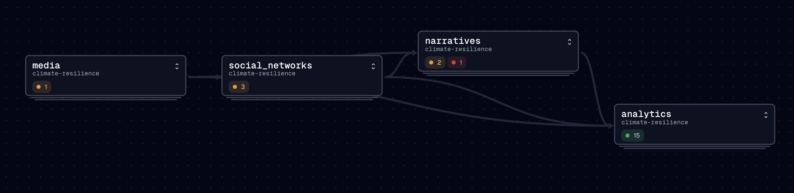

Bla

## 🏛️ Design



## 📊 Data Assets

Let's start by listing the data assets we have on the platform.

> **Note**
>
> I'm using the [damn_tool](https://github.com/republicofdata-io/damn) package to list the assets.

``` python
import json
from damn_tool.ls import list_assets

result = list_assets(configs_dir="../.damn/")
data = json.loads(result)

organized_data = {}
for item in data["ls"]:
    product, key = item.split("/", 1)
    if product not in organized_data:
        organized_data[product] = []
    organized_data[product].append(key)

for product, keys in organized_data.items():
    print(f"{product}:")
    for key in keys:
        print(f" - {key}")
```

    analytics:
     - int__media_articles
     - int__social_network_conversations
     - int__social_network_posts
     - int__social_network_user_profiles
     - media_articles_fct
     - social_network_conversations_dim
     - social_network_posts_fct
     - social_network_user_profiles_dim
     - stg__conversation_classifications
     - stg__conversation_event_summaries
     - stg__nytimes_articles
     - stg__post_narrative_associations
     - stg__user_geolocations
     - stg__x_conversation_posts
     - stg__x_conversations
    media:
     - nytimes_articles
    narratives:
     - conversation_classifications
     - conversation_event_summary
     - post_narrative_associations
    social_networks:
     - user_geolocations
     - x_conversation_posts
     - x_conversations
